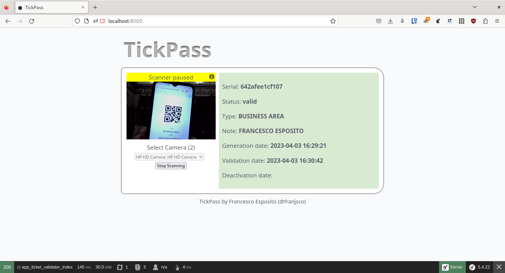
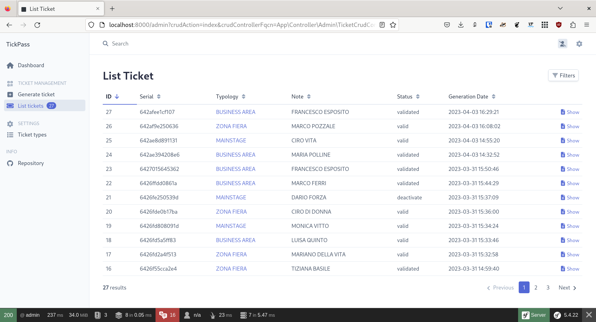
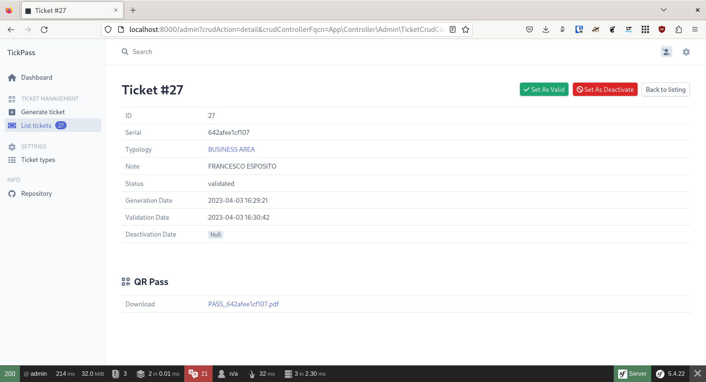

# TickPass

[](https://opensource.org/licenses/)

TickPass is a web application for managing tickets and admissions with QR Code passes.


## Features

- Generate Ticket with QR Code passes
- Scan & validate QR Code passes
- Web based


## Screenshots








## Tech Stack

**Client:** HTML5/CSS

**Server:** PHP 8, Symfony 5

**Tools:** Docker, Symfony CLI

## Development

Clone the repository
``` bash
git clone https://github.com/franjsco/TickPass
```

Go to the project directory
```bash
cd TickPass
```

Install dependencies
```bash
composer install
```

Configure .env (DATABASE_URL)
```
DATABASE_URL
```

Start docker containers
```bash
docker compose up -d
```

Start development server

```bash
  symfony server:start 
``` 


